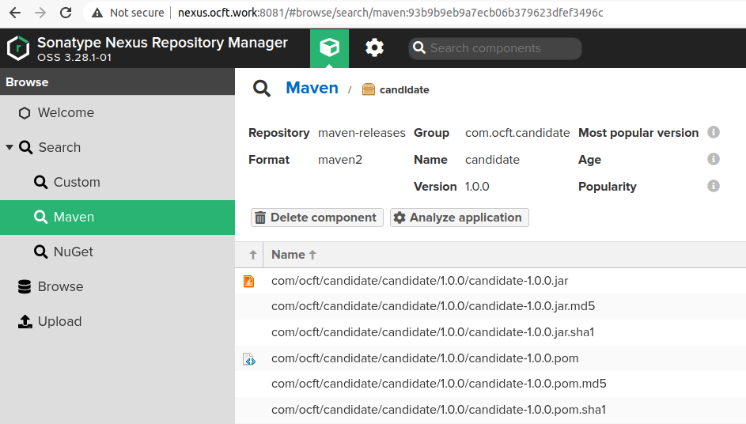

#### Manually install jar file to nexus


Create below settings.xml file in ~/.m2/  (maven setting folder in your own directory)

```
<settings>
<servers>
  <server>
    <id>nexus</id>
    <username>admin</username>
    <password>--to-be-shared-separately--</password>
  </server>
</servers>
</settings>

```


Locate the jar file you want install to remote nexus server. Down load the sample candidate.jar from this repo.

```
aaron@aaron-RedmiBook-16:~/Workspaces/oc-nexus$ ls
candidate.jar  README.md

```

Run below maven command to install the jar file to remote nexus

```
mvn deploy:deploy-file -DgroupId=com.ocft.candidate \
    -DartifactId=candidate \
    -Dversion=1.0.0 \
    -Dpackaging=jar \
    -Dfile=candidate.jar \
    -DgeneratePom=true \
    -DrepositoryId=nexus \
    -Durl=http://nexus.ocft.work:8081/repository/maven-releases/
```

Note: repositoryId must match with id value in settings.xml so that the credential configured will take effect.

Once completed, you will find jar file is already uploaded




To reference dependencies from Nexus, put this in the pom.xml of your project

```
<project ...>
  ...
  <repositories>
    <repository>
      <id>nexus</id>
      <url>http://nexus.ocft.work:8081/repository/maven-releases/</url>
    </repository>
  </repositories>
  ...

    <dependencies>
    <dependency>
      <groupId>com.ocft.candidate</groupId>
      <artifactId>candidate</artifactId>
      <version>1.0.0</version>
      <scope>test</scope>
    </dependency>
  </dependencies>

</project>
```

